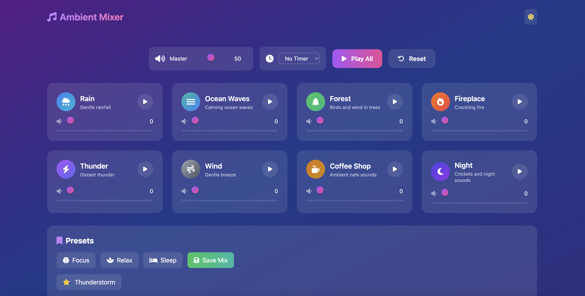

# 🎵 Ambient Sound Mixer

Ambient Sound Mixer is a web-based sound generator designed to help users focus, relax, or sleep. It allows users to layer multiple ambient sounds, adjust individual volumes, set sleep timers, and save personalized audio "presets."

Deployed at https://ambient-sound-mixer-app.vercel.app/.



## ✨ Features

- **Multi-Track Layering**: Play multiple ambient sounds simultaneously to create a complex environment.
- **Granular Volume Control**: Adjust the volume of each sound independently or use the master volume for global control.
- **Custom Presets**: Save your favorite sound combinations and volume levels to local storage for future sessions.
- **Sleep Timer**: Set a countdown timer that automatically fades out or stops all sounds when finished.
- **Responsive UI**: A modern, interactive interface featuring:
  - Dynamic sound card rendering.
  - Dark/Light mode support.
  - Real-time volume visualizers.
  - Event Delegation: Optimized performance using a single event listener for dynamic UI elements.

## 🏗️ Architecture

The project follows a modular Object-Oriented Programming (OOP) approach:

### Module

- `AmbientMixer`: The "Brain" (Controller). Orchestrates communication between all other modules.
- `SoundManager`: Handles the Web Audio logic: loading, playing, pausing, and stopping files.
- `UI`: Manages the DOM: rendering cards, updating sliders, and handling theme toggles.
- `PresetManager`: Handles localStorage logic for saving, loading, and deleting custom presets.
- `Timer`: Manages the countdown logic and triggers callbacks for UI updates and sound cessation.

## 🚀 Getting Started

### Prerequisites

- A modern web browser (Chrome, Firefox, Edge, or Safari).
- A local development server (like VS Code Live Server) to handle ES6 module imports.

### Installation

1. Clone the repository:

```
git clone https://github.com/philipstubbs13/ambient-sound-mixer-app.git
```

2. Add your audio assets: Place your `.mp3` or `.wav` files inside an `/audio` folder in the root directory.

3. Configure sound data: Ensure `soundData.js` contains the correct mapping for your audio files:

```
export const sounds = [
  { id: 'rain', name: 'Rain', file: 'rain.mp3' },
  // ...
];
```

4. Launch: Open `index.html` via a local server.

## 🛠️ Usage

## Creating a Mix

1. Click the Play button on any sound card.
2. Adjust the Slider on the card to set the individual volume.
3. Use the Master Volume slider at the bottom to adjust the overall intensity.

## Saving a Preset

1. Once you find a mix you love, click Save Preset.
2. Enter a name in the modal and confirm.
3. Your preset will appear in the "Custom Presets" sidebar/section.

## Using the Timer

1. Select a duration (for exaple, 30 minutes) from the timer dropdown.
2. The mixer will automatically stop all audio once the time expires.

## 📝 Technical Details

- Persistence: Custom presets are stored in the browser's `localStorage`, meaning they persist even after refreshing the page.
- Performance: Uses Event Delegation on the document level to handle clicks for dynamically generated sound cards and preset buttons, reducing memory overhead.
- State Management: The `currentSoundState` object tracks active volumes in real-time to ensure presets are saved accurately.

## 🤝 Contributing

Contributions are welcome! Please feel free to submit a pull request or open an issue for any bugs or feature requests.
